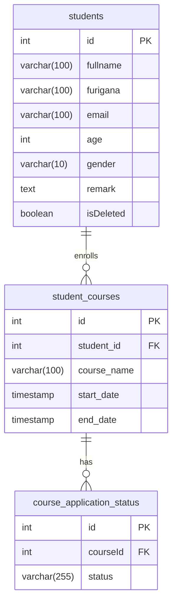
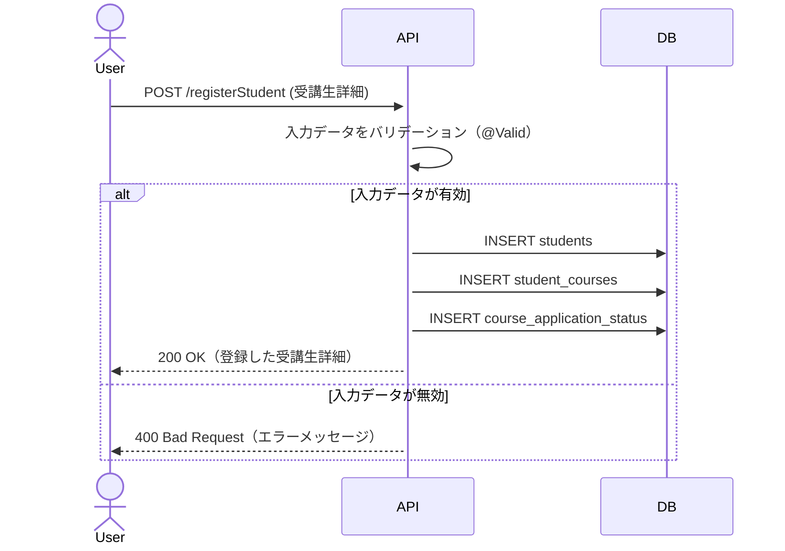
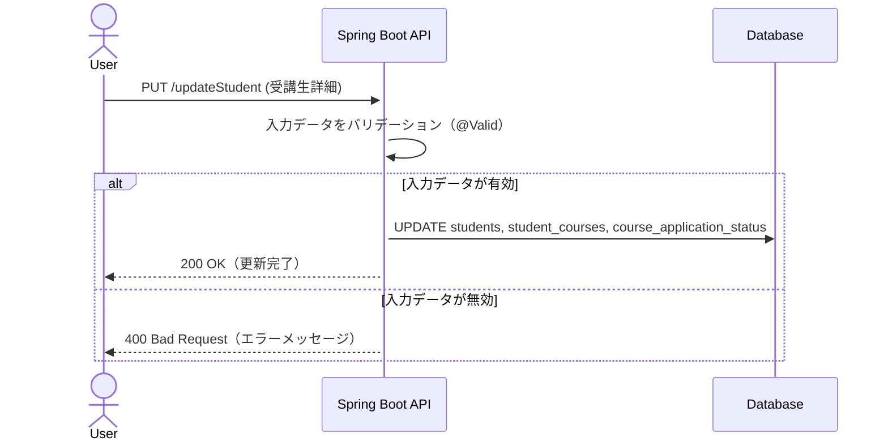
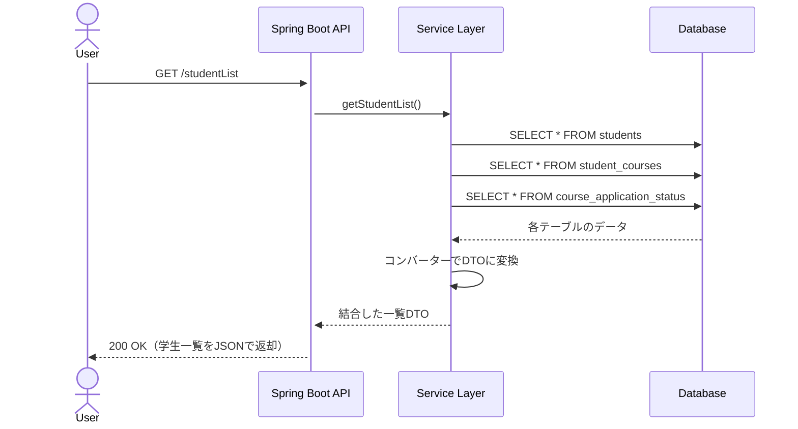
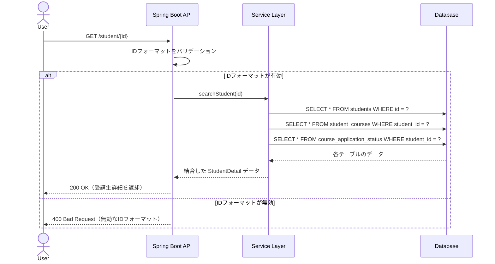

# StudentManagement

## 🏁 はじめに

本アプリケーションは、
**JavaとSpring BootによるWebアプリケーション開発を学習する目的で作成したポートフォリオ**になります。

## 🧾 サービス概要

このプロジェクトは、**ITスクール運営者向けの内部管理システム**です。
受講生のプロフィール、コースの受講状況、申し込み内容などを一元管理でき、オンラインスクール運営における業務の効率化と情報の見える化を支援します。

## 💻 開発環境

**使用技術**  

バックエンド

  
  

インフラ

使用ツール

## 📘 機能一覧

| 機能         | 詳細                                        | メソッド | URL                    |
|--------------|---------------------------------------------|----------|------------------------|
| 受講生登録     | 新しい受講生の詳細を登録する                          | POST     | `/registerStudent`     |
| 受講生更新     | 既存の受講生情報を更新する                            | PUT      | `/updateStudent`       |
| 論理削除       | 指定した受講生を論理的に削除する                      | DELETE   | `/deleteStudent/{id}`  |
| 受講生取得(ID) | 指定したIDの受講生詳細を取得する                      | GET      | `/student/{id}`        |
| 受講生一覧     | 全ての受講生情報（論理削除されていないもの）を取得する | GET      | `/studentList`         |

### シーケンス図

#### 受講生詳細の登録フロー

#### 受講生詳細の更新フロー

#### 受講生詳細の全件検索フロー

#### 受講生のID検索フロー

